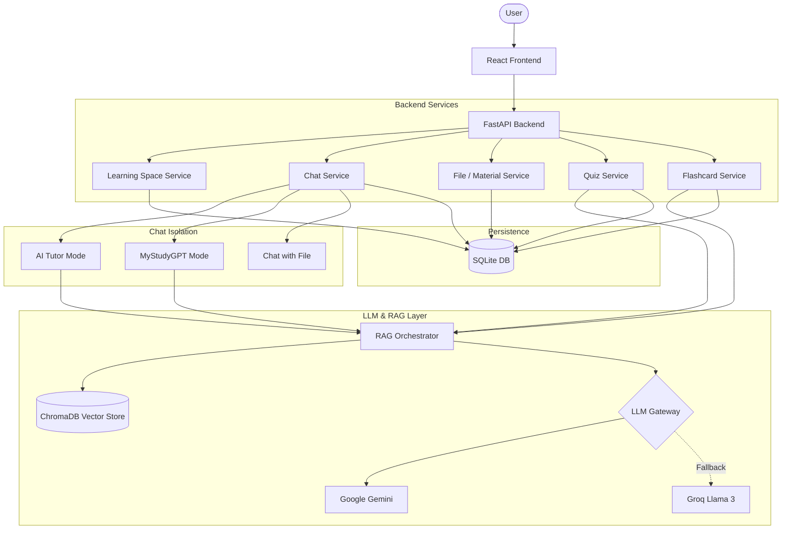

# Vinaval AI — Learning Arena

A highly performant, AI-powered learning platform designed for competitive exam preparation (NEET/TNPSC). The application delivers hybrid document-grounded tutoring, automated quiz generation, and progressive flashcard generation natively streaming via Server-Sent Events (SSE).

---

## 📖 The Solution

Vinaval AI solves the challenge of contextual studying by strictly grounding large language models on official State Board curriculum materials and user-uploaded PDFs using a fast, robust Retrieval-Augmented Generation (RAG) pipeline.

### Core Features
- **AI Tutor:** Interactive chat natively grounded in official curriculum material.
- **Materials/MyStudyGPT:** Allows uploading user documents. MyStudyGPT explicitly rejects fallback to general knowledge, ensuring chat responses are strictly confined to the user-uploaded syllabus context.
- **TN Textbook RAG:** Intelligent context retrieval strictly pointing to `neet_botany`, `neet_physics`, etc. ChromaDB collections.
- **File-based Chat Contexts:** Chat histories are isolated between AI Tutor and MyStudyGPT modes at the database level.
- **Quiz / Exam Lab:** Progressively streaming, auto-generated JSON quizzes strictly enforcing context grounding.
- **Flashcards:** Progressively streaming Newline Delimited JSON (NDJSON) flashcards.
- **Smart Revision & Smart Notes:** AI-generated progress tracking and dynamic summaries.

---

## 🛠️ Technology Stack

- **Frontend:** React, Vite (Component-driven SPA)
- **Backend API:** FastAPI (Async Python framework)
- **Database:** SQLite (Persistence for Users, Sessions, Chat History, Quizzes, Flashcards)
- **Vector Database:** ChromaDB (Embeddings using `paraphrase-multilingual-MiniLM-L12-v2` for EN/TA bilingual native support)
- **AI / LLM:** 
  - **Primary:** Gemini (Streaming capabilities)
  - **Fallback:** Groq (Llama 3 70B) for seamless rate-limit handling and high-availability.
- **Streaming Architecture:** Server-Sent Events (SSE) emitting custom structured payloads and NDJSON for extremely low Time To First Token (TTFT).

---

## 🏗️ Architecture Map



### Advanced RAG Retrieval Flow
Document Ingestion → Text Extraction → Semantic Chunking → Embeddings → ChromaDB → Similarity Retrieval → Relevant Context Construction → LLM Injection → Grounded Response Output.

---

## ⚡ Performance Optimizations

During recent scaling, the application underwent significant performance optimization:

- **LLM TTFT Latency:** Fixed decommissioned model references that previously triggered massive API SDK retry/backoff loops. **Normal chat TTFT plummeted from ~14.37 seconds to ~0.6–1.1 seconds.**
- **Progressive Streaming for Data Types:** Instead of awaiting complete JSON generation for 10-20 questions/flashcards, the system utilizes highly optimized NDJSON stream generators with real-time brace-counting token parsing. Results stream instantly to the frontend (TTFT < 2s).

---

## 🚀 Setup & Run Instructions

### 1. Environment Setup
1. Clone the repository.
2. Create a Python virtual environment: `python -m venv venv`
3. Install backend dependencies: `cd backend && pip install -r requirements.txt`
4. Install frontend dependencies: `cd frontend && npm install`
5. Configure `.env` in the `backend/` folder (use `.env.example` as a template).

### 2. Start the Backend (API + RAG Engine)
On **Windows**:
```bash
./start.bat
```
On **Mac/Linux**:
```bash
./start.sh
```
*The FastAPI backend will run silently on `http://127.0.0.1:8000`.*

### 3. Start the Frontend
In a new terminal window:
```bash
cd frontend
npm run dev
```
*Navigate to `http://localhost:5173` to access Vinaval AI.*
