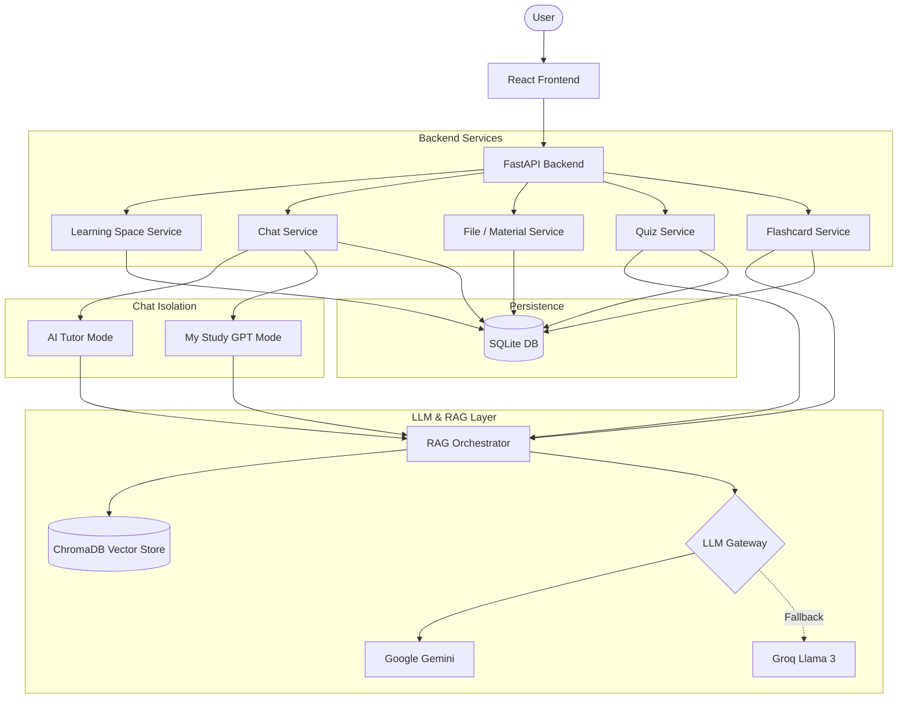

# Vinaval AI — Learning Arena

A highly performant, AI-powered learning platform designed for competitive exam preparation (NEET/TNPSC). The application delivers hybrid document-grounded tutoring, automated quiz generation, and progressive flashcard generation natively streaming via Server-Sent Events (SSE).

---

## 📖 The Solution

Vinaval AI solves the challenge of contextual studying by strictly grounding large language models on official State Board curriculum materials and user-uploaded PDFs using a fast, robust Retrieval-Augmented Generation (RAG) pipeline.

### Core Features
- **AI Tutor:** Interactive chat natively grounded in official curriculum material via a robust vector retrieval system.
- **My Study GPT & Materials:** Allows uploading user documents (PDFs, notes). The system extracts, chunks, and embeddings these documents, explicitly restricting chat responses to the user's uploaded syllabus context.
- **TN Textbook RAG:** Intelligent context retrieval strictly pointing to exam-specific ChromaDB collections (e.g., `neet_physics`, `neet_botany_ta`).
- **Exam Lab (Quiz Generator):** Progressively streaming, auto-generated JSON quizzes enforcing context grounding. Supports full mock exams and topic-based practice with built-in timers.
- **Performance Analytics:** Comprehensive post-quiz result analysis, tracking user scores and history.
- **Flashcards:** Progressively generated flashcard decks streamed via Server-Sent Events (SSE) for active recall studying.
- **Bilingual Native Support:** Supports generation and querying in English and Tamil.

---

## 🛠️ Technology Stack

- **Frontend:** React, Vite (Component-driven SPA)
- **Backend API:** FastAPI (Async Python framework)
- **Database:** SQLite (Persistence for Users, Spaces, Chat History, Quizzes, Flashcards) using SQLAlchemy + `aiosqlite` and Alembic.
- **Vector Database:** ChromaDB (Local Embeddings using `paraphrase-multilingual-MiniLM-L12-v2`)
- **Authentication:** Firebase Admin SDK (JWT decoding and validation)
- **AI / LLM:** 
  - **Primary:** Google Gemini (Streaming capabilities)
  - **Fallback:** Groq (Llama 3) for seamless rate-limit handling and high-availability.
- **Streaming Architecture:** Server-Sent Events (SSE) emitting structured event blocks for extremely low Time To First Token (TTFT).

---

## 🏗️ Architecture Map



### Advanced RAG Retrieval Flow
Document Ingestion → Text Extraction (`pymupdf` / `pdfplumber`) → Semantic Chunking → Embeddings → ChromaDB → Similarity Retrieval → Relevant Context Construction → LLM Injection → Grounded Response Output.

---

## ⚡ Performance Optimizations

During scaling and stabilization, the application underwent significant performance optimizations:

- **SSE Stream Processing:** Instead of awaiting complete JSON generation for multi-item arrays (like quizzes and flashcards), the system utilizes standard Server-Sent Events (SSE). Chunks are buffered safely across network boundaries, allowing the React frontend to progressively render questions and flashcards instantly.
- **LLM TTFT Latency Reduction:** Fallback configurations seamlessly handle rate limits, ensuring continuous generation.

---

## 🚀 Setup & Run Instructions

### 1. Environment Setup
1. Clone the repository.
2. Create a Python virtual environment: `python -m venv venv`
3. Install backend dependencies: `cd backend && pip install -r requirements.txt`
4. Install frontend dependencies: `cd frontend && npm install`
5. Configure `.env` in the `backend/` folder (use `backend/.env.example` as a template).
6. Place your `firebase-service-account.json` in the `backend/` folder and link it in the `.env` file.

### 2. Start the Backend (API + RAG Engine)
On **Windows**:
```bash
./start.bat
```
On **Mac/Linux**:
```bash
./start.sh
```
*The FastAPI backend will automatically kill orphaned ports and run silently on `http://127.0.0.1:8000`.*

### 3. Start the Frontend
In a new terminal window:
```bash
cd frontend
npm run dev
```
*Navigate to `http://localhost:5173` to access Vinaval AI.*
